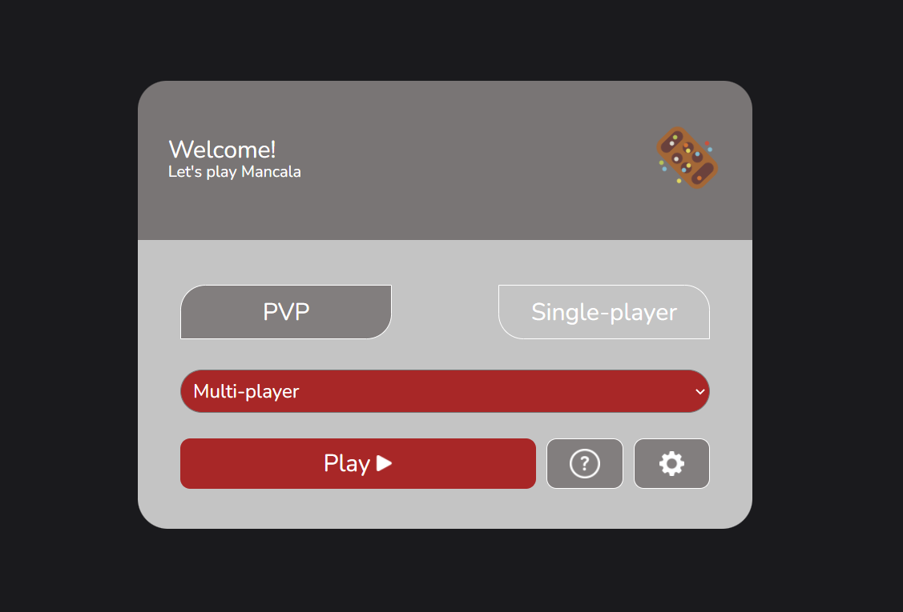
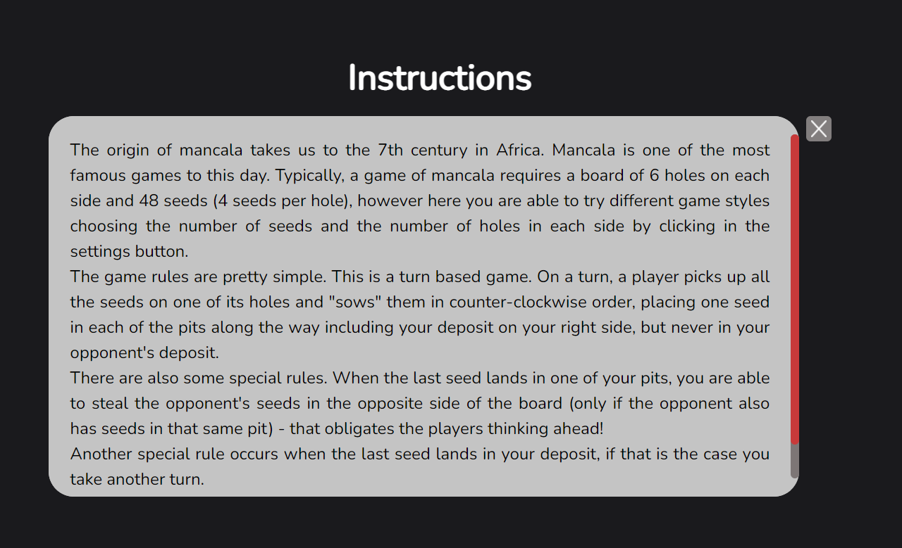
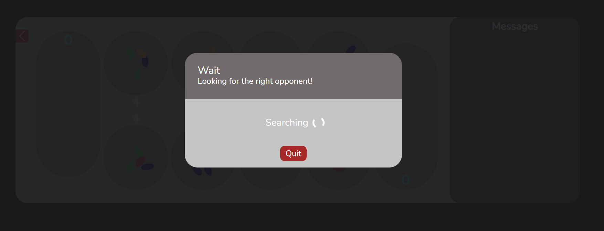
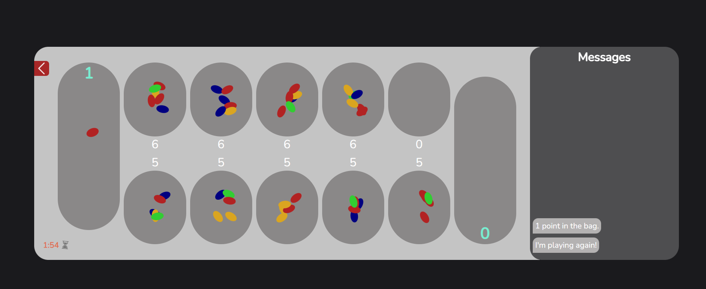
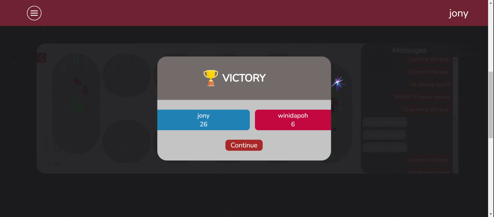

# FEUP-LTW 2021/2022
Mancala web game project in HTML/CSS/Javascript for the LTW curricular unit.

### Project Infos
* **Date:** 3nd Year, 1st Semester, 2021/2022
* **Course:** Linguagens e Tecnologias Web (LTW) | Web Languages and Technologies
* **Course Link:** [Course Link](https://sigarra.up.pt/feup/pt/ucurr_geral.ficha_uc_view?pv_ocorrencia_id=484430)

### Usage

#### Run the node server in index.js file:
```
$ node index.js
```
Make sure to keep the server and app url the same in order to make the program work.

### Screenshots
* Main menu

* Instructions menu

* Wait menu

* Game menu

* Game end animation


### Disclaimer
This repository, and every other FEUP-COURSE* repos on GitHub correspond to school projects from the respective COURSE. The code on this repo is intended for educational purposes. I do not take any responsibility, liability or whateverity over any code faults, inconsistency or anything else. If you intend on copying most or parts of the code for your school projects, keep in mind that this repo is public, and that your professor might search the web for similar project solutions or whatnot and choose to fail you for copying.

### Credits
Credits to [Miguel Rodrigues](https://github.com/mbrdg), for helping with the development of the LTW Project.
